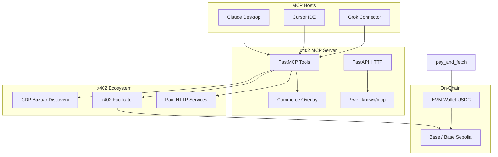

# x402 Micropayments MCP — Architecture

**Drive UI version:** N/A (server-side MCP)  
**x402 protocol:** v2 (PAYMENT-REQUIRED / PAYMENT-SIGNATURE / PAYMENT-RESPONSE)  
**Project folder:** `/Forge/MCP_Projects/x402-micropayments/`

## Context Diagram

## Tool Inventory

| Tool | Role | Wallet Required |
|------|------|-----------------|
| `discover_services` | Buyer — find paid APIs in Bazaar | No |
| `get_payment_requirements` | Buyer — probe 402 headers | No |
| `pay_and_fetch` | Buyer — auto-pay and fetch resource | Yes (`EVM_PRIVATE_KEY`) |
| `build_seller_requirements` | Seller — construct payment requirements | `X402_PAY_TO_ADDRESS` |
| `verify_payment_payload` | Seller — validate payment via facilitator | No |
| `get_supported_networks` | Reference — networks, facilitators, headers | No |

## Commerce Overlay (MCP Layer)

Separate from on-chain x402 micropayments:

- **Free tier:** 500 MCP tool calls/month, 10/min sliding window
- **Meta envelope** on every tool response: `tier`, `calls_this_month`, `quota_remaining`, `quota_warning`, `rate_limit_remaining`, `upgrade_url`, `agent_id`
- **429 responses** with `retry_after` and `upgrade_url`
- **Redis migration:** replace `InMemoryQuotaStore` when `REDIS_URL` is set

## Security & Consent

- Wallet private keys never returned in tool responses
- `pay_and_fetch` requires explicit server-side `EVM_PRIVATE_KEY` configuration
- HSA review: no credential exfiltration; agents must consent to on-chain spend per x402 protocol
- Input validation via Pydantic on all tool parameters

## Transport

| Mode | Command |
|------|---------|
| stdio | `python run_stdio.py` |
| HTTP + SSE | `uvicorn app.main:app --port 8402` |
| Manifest | `GET /.well-known/mcp` |